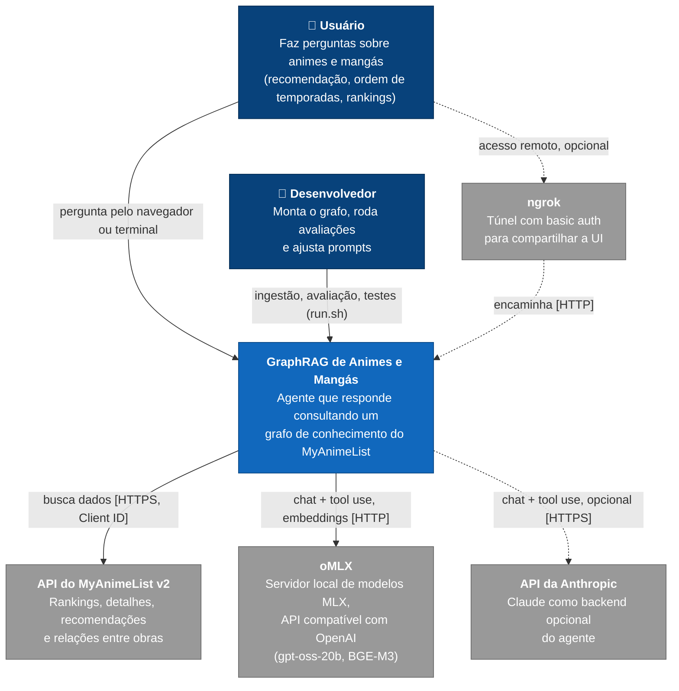
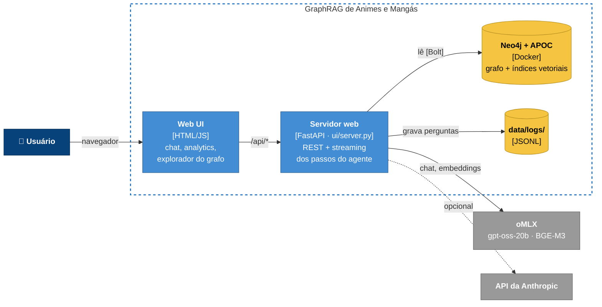
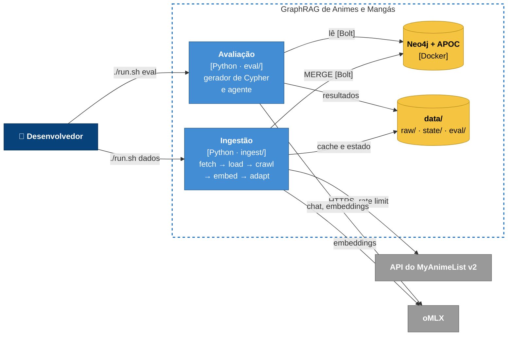
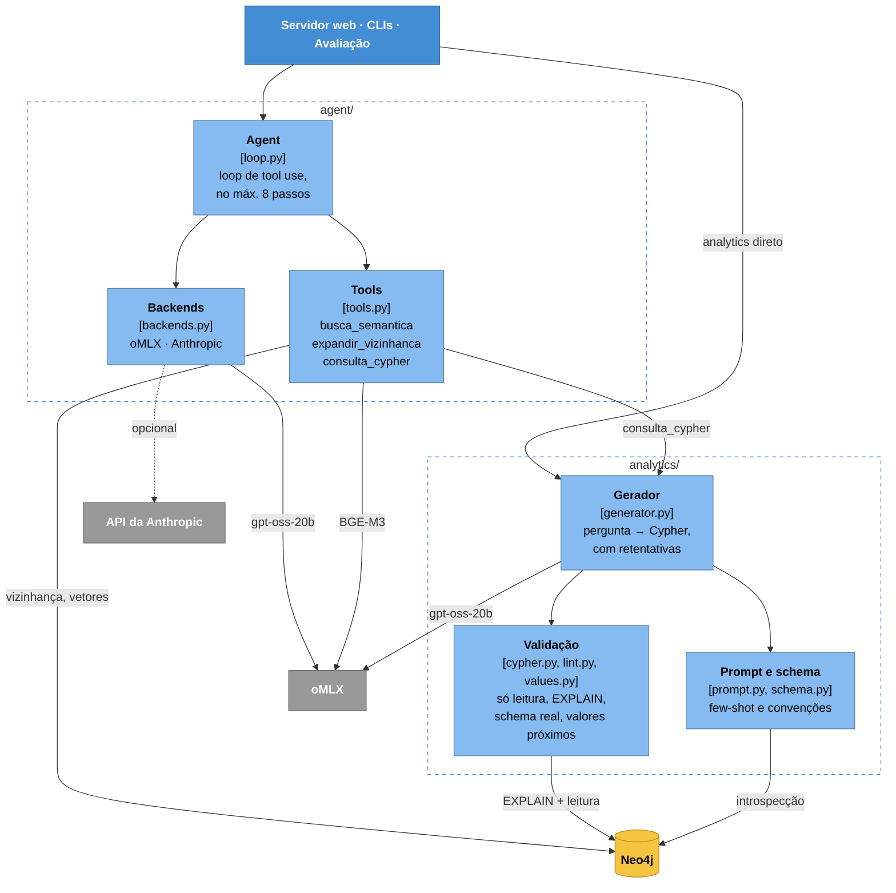

# Arquitetura (modelo C4)

🇺🇸 [English version](08%20-%20C4%20Architecture.md)

Voltar: [00 - Índice GraphRAG Anime](00%20-%20%C3%8Dndice%20GraphRAG%20Anime.md) · Ver também: [01 - Visão Geral](01%20-%20Vis%C3%A3o%20Geral.md)

Três níveis do [modelo C4](https://c4model.com): contexto, contêineres e componentes. Os diagramas são Mermaid (flowchart com as cores do C4) porque o `C4Context` do Mermaid ainda é experimental e organiza mal o layout.

Legenda das cores:
- **azul-marinho:** pessoa;
- **azul:** o sistema (nível 1), seus contêineres (nível 2) e componentes (nível 3, azul-claro);
- **amarelo:** armazenamento (Neo4j, arquivos em `data/`);
- **cinza:** sistema externo;
- **linha tracejada:** dependência opcional.

## Nível 1: Contexto

Quem usa o sistema e de quais sistemas externos ele depende.

## Nível 2: Contêineres

Os processos e armazenamentos que formam o sistema. Todos rodam no Mac; só o Neo4j fica em Docker. Para caber na tela, o nível está dividido em dois diagramas: a hora da pergunta e a preparação.

### Hora da pergunta

As **CLIs** (`python -m agent` e `python -m analytics`) fazem o mesmo caminho do servidor web, sem a UI: usam o mesmo núcleo (nível 3), leem o Neo4j, chamam o oMLX (ou o Claude) e gravam em `data/logs/`.

### Preparação

O painel de avaliação da Web UI lê os resultados em `data/eval/`.

## Nível 3: Componentes do agente e do gerador de Cypher

O núcleo compartilhado pelo servidor web, pelas CLIs e pela avaliação: os pacotes `agent/` e `analytics/`.

### Observações
- **`consulta_cypher` sempre usa o oMLX.** Mesmo com `AGENT_BACKEND=anthropic`, só o loop do agente vai para o Claude; o gerador de Cypher continua no gpt-oss-20b local (`CYPHER_MODEL`).
- **Um modelo só na memória.** No backend local, agente e gerador usam o mesmo gpt-oss-20b, por isso o oMLX precisa do *memory guard* em `aggressive` para caber ao lado do Neo4j.
- **Escrita só na ingestão.** Servidor web, CLIs e avaliação abrem transações de leitura; apenas `ingest/` escreve no grafo, sempre com `MERGE` (idempotente).
