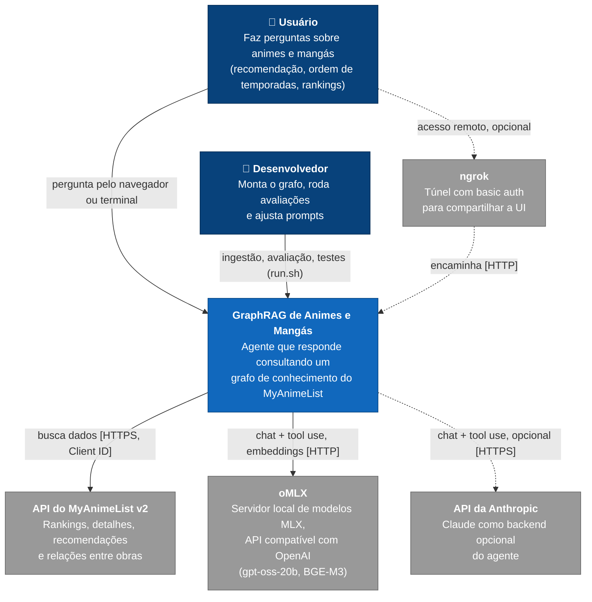
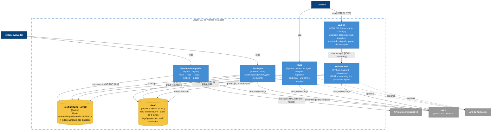
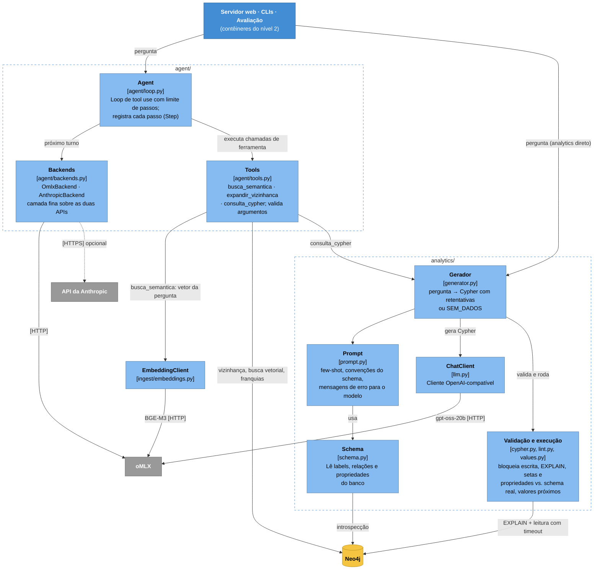

# Arquitetura (modelo C4)

Voltar: [[00 - Índice GraphRAG Anime]] · Ver também: [[01 - Visão Geral]]

Três níveis do [modelo C4](https://c4model.com): contexto, contêineres e componentes. Os diagramas são Mermaid (flowchart com as cores do C4) porque o `C4Context` do Mermaid ainda é experimental e organiza mal o layout.

Legenda: 🟦 pessoa · 🟦 escuro = sistema/contêiner deste projeto · ⬜ cinza = sistema externo · 🟨 = armazenamento.

## Nível 1: Contexto

Quem usa o sistema e de quais sistemas externos ele depende.

## Nível 2: Contêineres

Os processos e armazenamentos que formam o sistema. Todos rodam no Mac; só o Neo4j fica em Docker.

## Nível 3: Componentes do agente e do gerador de Cypher

O núcleo compartilhado pelo servidor web, pelas CLIs e pela avaliação: os pacotes `agent/` e `analytics/`.

### Observações
- **`consulta_cypher` sempre usa o oMLX.** Mesmo com `AGENT_BACKEND=anthropic`, só o loop do agente vai para o Claude; o gerador de Cypher continua no gpt-oss-20b local (`CYPHER_MODEL`).
- **Um modelo só na memória.** No backend local, agente e gerador usam o mesmo gpt-oss-20b, por isso o oMLX precisa do *memory guard* em `aggressive` para caber ao lado do Neo4j.
- **Escrita só na ingestão.** Servidor web, CLIs e avaliação abrem transações de leitura; apenas `ingest/` escreve no grafo, sempre com `MERGE` (idempotente).
