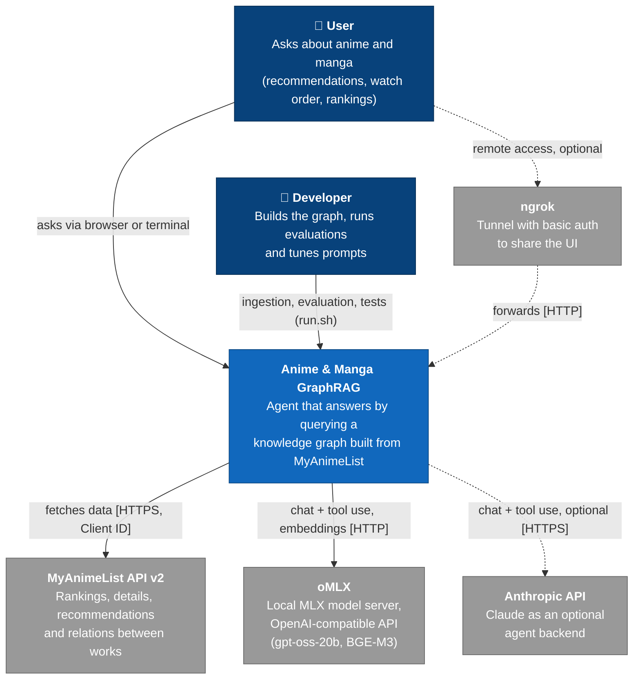
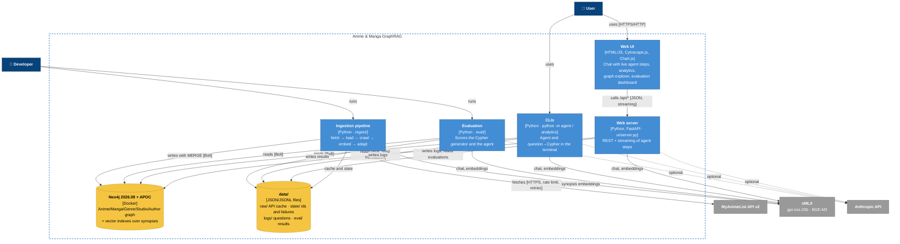
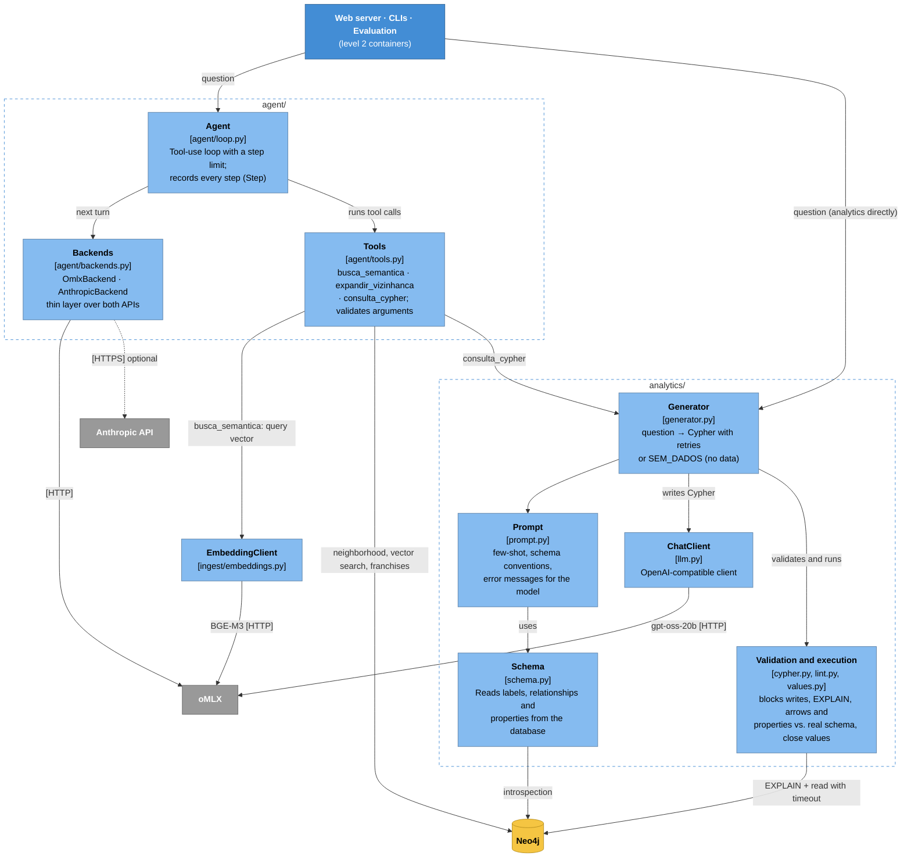

# Architecture (C4 model)

🇧🇷 [Versão em português](08%20-%20Arquitetura%20C4.md)

Back: [README](../README.md)

Three levels of the [C4 model](https://c4model.com): context, containers and components. The diagrams are Mermaid flowcharts with the C4 colors, because Mermaid's `C4Context` is still experimental and lays things out poorly.

Tool names (`busca_semantica`…), the `SEM_DADOS` marker and the `data/` folders keep their Portuguese names, as in the code.

Color legend:
- **navy:** person;
- **blue:** the system (level 1), its containers (level 2) and components (level 3, light blue);
- **yellow:** storage (Neo4j, files under `data/`);
- **gray:** external system;
- **dashed line:** optional dependency.

## Level 1: System context

Who uses the system and which external systems it depends on.

## Level 2: Containers

The processes and stores that make up the system. Everything runs on the Mac; only Neo4j runs in Docker.

## Level 3: Components of the agent and the Cypher generator

The core shared by the web server, the CLIs and the evaluation: the `agent/` and `analytics/` packages.

### Notes
- **`consulta_cypher` always uses oMLX.** Even with `AGENT_BACKEND=anthropic`, only the agent loop goes to Claude; the Cypher generator stays on the local gpt-oss-20b (`CYPHER_MODEL`).
- **One model in memory.** With the local backend, the agent and the generator share the same gpt-oss-20b, which is why oMLX's *memory guard* must be `aggressive` to fit next to Neo4j.
- **Only ingestion writes.** The web server, CLIs and evaluation open read transactions; only `ingest/` writes to the graph, always with `MERGE` (idempotent).
